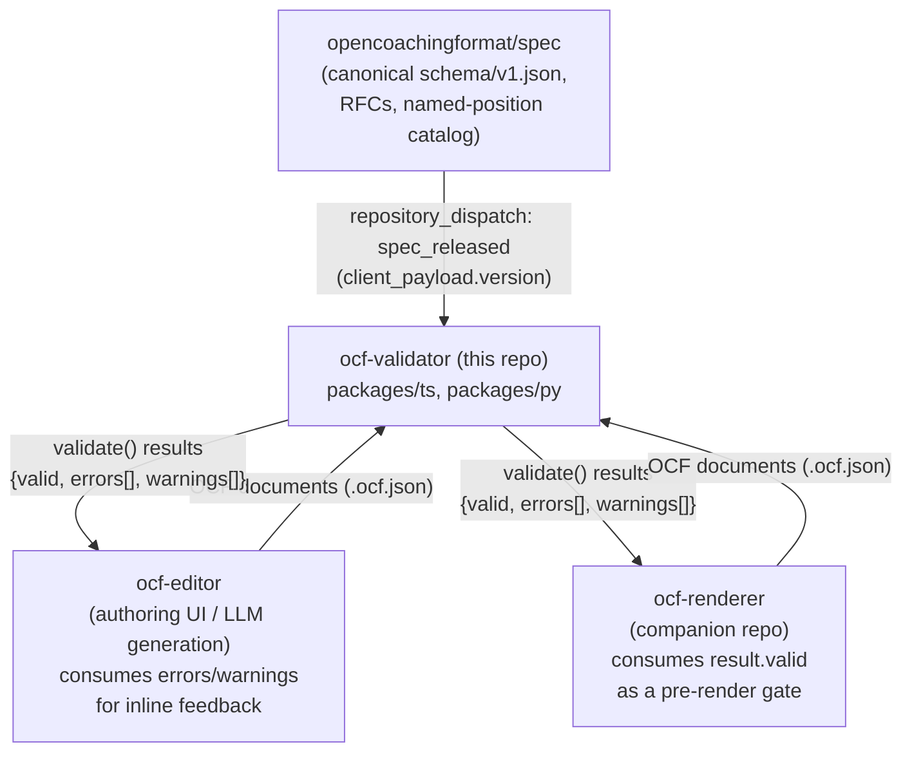

# 3. System Scope and Context

## 3.1 Business Context

## 3.2 Technical Context

| Interface | Direction | Description |
|---|---|---|
| `validate(doc)` / `validate_file(path)` library call | Inbound | Primary integration point for both editor and renderer tooling. Never throws for validation failures — only for true programmer errors (non-object argument). |
| `ocf-validate` CLI | Inbound | Thin wrapper over the library API; used in scripts/CI of *consumer* repos, and interactively by humans. |
| `shared/schema/ocf-action-v1.json`, `shared/error-codes.json`, `shared/conformance/**` | Internal, shared | Language-neutral contract consumed identically by `packages/ts` and `packages/py`; not a public interface to other repos. |
| GitHub Contents API (`repos/opencoachingformat/spec/contents/schema/v1.json`) | Outbound (CI only) | Used exclusively by the `sync-from-spec` workflow to fetch the schema at a released ref — not used at validation runtime. |
| `repository_dispatch` webhook (`spec_released`) | Inbound (CI only) | The spec repo (or its release automation) notifies this repo that a new version was released, carrying `client_payload.version`. |
