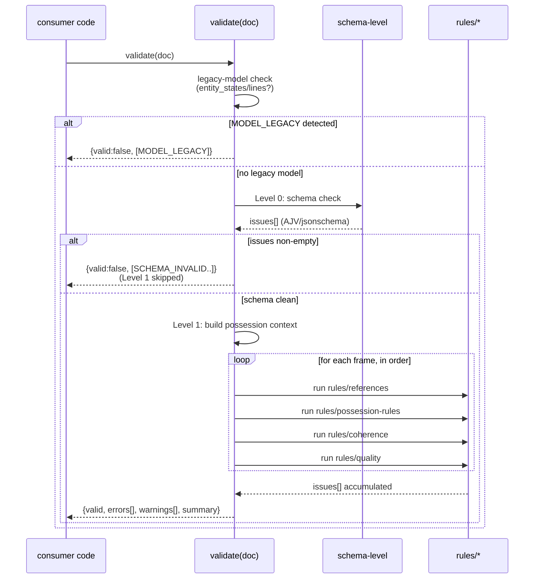
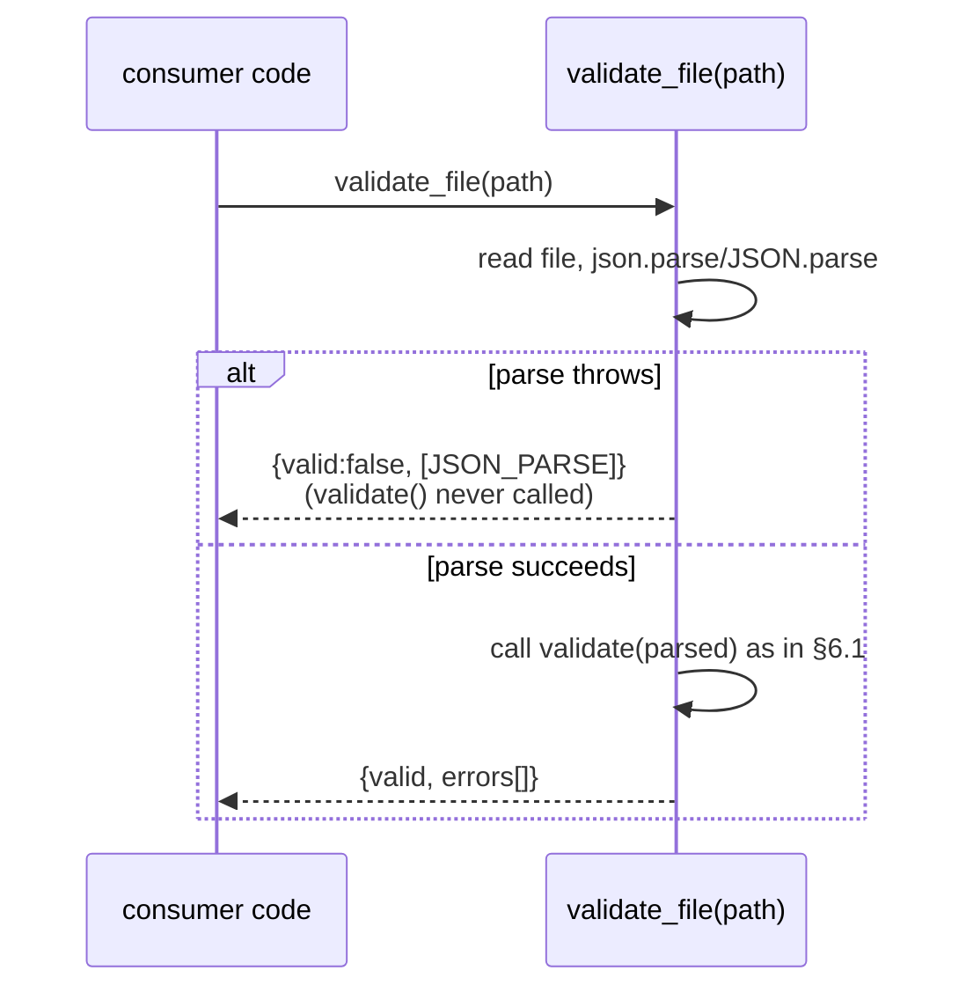
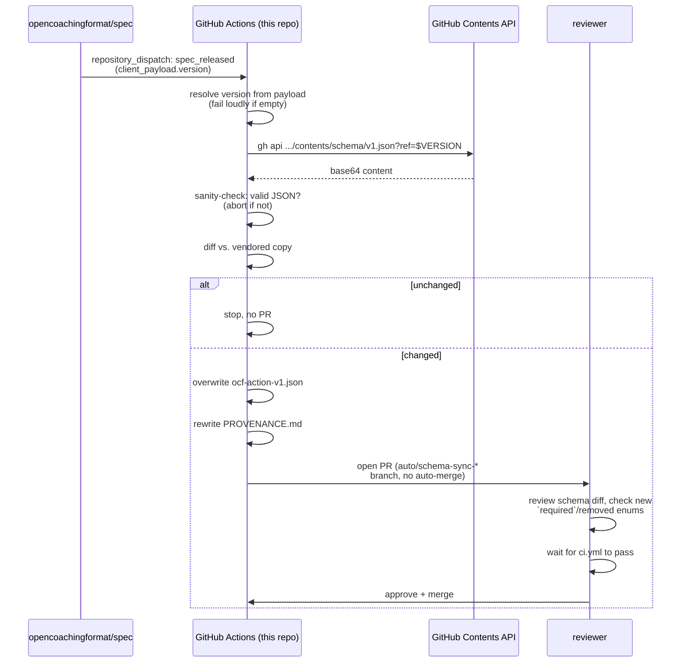

# 6. Runtime View

## 6.1 Scenario: Validating a document via the library API

Key behaviors:

- **Never throws** for validation failures — a malformed document always
  produces a populated `errors[]`, never an exception. Exceptions are
  reserved for programmer errors (e.g. calling `validate(null)`).
- **Short-circuit at Level 0**: if the schema check produces any issue,
  Level 1 rules never execute — avoids nonsensical semantic errors over
  structurally broken data (e.g. asking "does this ball exist" when `balls`
  itself failed schema validation).
- **Possession context threads across frames**: rule groups in Level 1 are
  not independent — `rules/possession-rules` and `rules/coherence` both read
  and advance the same per-frame ball-possession state, processed in frame
  array order (see [§7 in the design doc](../superpowers/specs/2026-06-03-ocf-validator-design.md#7-out-of-scope-for-v1)
  for the known `after`-ordering limitation).

## 6.2 Scenario: `validate_file(path)` — parse failure

`JSON_PARSE` is emitted only by `validate_file`/`validate_file`'s file-reading
wrapper — `validate(doc)` itself always receives an already-parsed object and
has no notion of parse failure.

## 6.3 Scenario: automated schema sync (CI, cross-repo)

