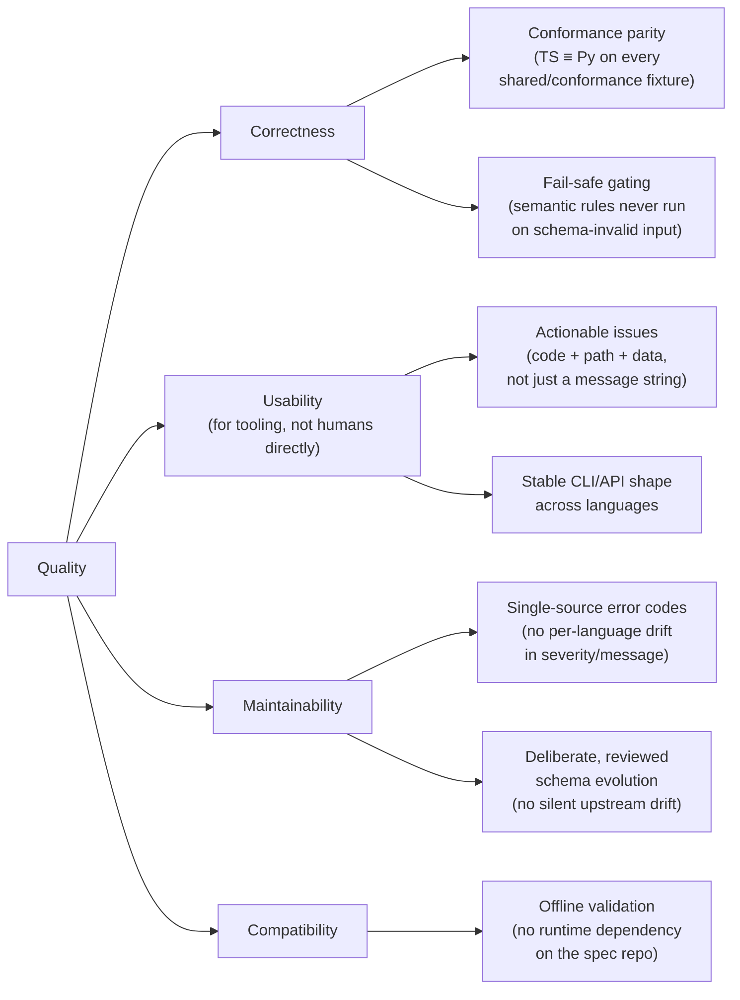

# 10. Quality Requirements

## 10.1 Quality Tree

## 10.2 Quality Scenarios

| # | Scenario | Expected response |
|---|---|---|
| Q1 | A new semantic rule is added to `packages/ts` but the equivalent is forgotten in `packages/py`. | `ci.yml`'s Python job fails on the conformance fixture that exercises the new rule — parity gap is caught before merge, not discovered later by a consumer. |
| Q2 | A document uses the legacy geometric model (`entity_states`/`lines`). | Validator returns a single `MODEL_LEGACY` error pointing at the current model, not a cascade of unrelated `SCHEMA_INVALID` issues. |
| Q3 | A document is syntactically invalid JSON, passed via `validate_file`. | Returns `{valid: false, errors: [{code: "JSON_PARSE", ...}]}` — no exception thrown, no crash of the calling tool. |
| Q4 | `opencoachingformat/spec` cuts a release and dispatches `spec_released` with a version where the schema is unchanged. | `sync-from-spec.yml` diffs, finds no change, and opens **no PR** — avoids PR noise for no-op releases. |
| Q5 | `opencoachingformat/spec` cuts a release with a breaking schema change (e.g. a new `required` field). | `sync-from-spec.yml` opens a PR; `ci.yml` runs on that PR and fails if the change breaks existing conformance fixtures, surfacing the breakage to a human reviewer before merge — never auto-merged. |
| Q6 | The `repository_dispatch` payload is missing `client_payload.version`. | The workflow fails immediately with an explicit `::error::` annotation ("refusing to sync") rather than attempting to fetch an ambiguous/`ref=` empty schema. |
| Q7 | An action-type schema branch is given a field it doesn't own (e.g. `intensity` on a `screen` action, which only accepts `physicality`). | Caught at Level 0 as `SCHEMA_INVALID` (via `additionalProperties: false` on the per-type schema branch), not silently accepted or caught later as a confusing semantic error. |
| Q8 | A consumer needs to validate a document entirely offline (no network access). | Succeeds — the schema is vendored in `shared/schema/`, not fetched at validation time. |
| Q9 | Two different consumer tools, one built against the TS package and one against the Python package, validate the same document. | Both report identical `errors`/`warnings` (same codes, same severities) — verified continuously by `shared/conformance`. |
